# Day 1 - Introduction to Verilog RTL design and synthesis

## 1. Introduction to open-source simulator iverilog

- iverilog is an open-source simulation tool.
- A simulator looks for changes in the input signals.
- Output is evaluated whenever a change in input is detected.
- If no change to the input , then no change to the output too.
- To view the simulation we need to provide different input values to the design and observe the outputs produced from the design. This is achieved by using testbench.

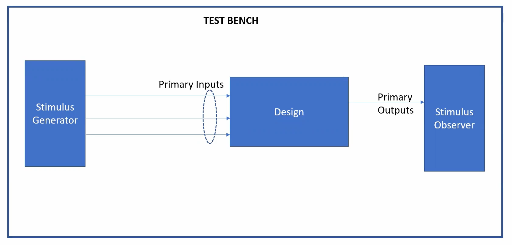

- iverilog generates vcd (value change dump format) file using the design and testbench files.
- gtkwave generates waveforms using .vcd file to visualize the input and output signals 

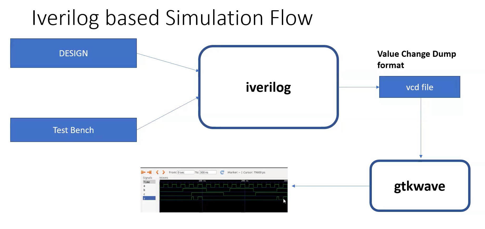


## 2. Lab using iverilog and gtkwave

iverilog tool is used to run the simulation

```
iverilog <design.v> <testbench.v>
```

here, design file good_mux.v and testbench file tb_good_mux.v is used for performing simulation.

Design file - good_mux.v:
```
module good_mux (input i0 , input i1 , input sel , output reg y);
always @ (*)
begin
	if(sel)
		y <= i1;
	else 
		y <= i0;
end
endmodule
```

testbench file - tb_good_mux.v :
```
`timescale 1ns / 1ps
module tb_good_mux;
	// Inputs
	reg i0,i1,sel;
	// Outputs
	wire y;

        // Instantiate the Unit Under Test (UUT)
	good_mux uut (
		.sel(sel),
		.i0(i0),
		.i1(i1),
		.y(y)
	);

	initial begin
	$dumpfile("tb_good_mux.vcd");
	$dumpvars(0,tb_good_mux);
	// Initialize Inputs
	sel = 0;
	i0 = 0;
	i1 = 0;
	#300 $finish;
	end

always #75 sel = ~sel;
always #10 i0 = ~i0;
always #55 i1 = ~i1;
endmodule
```

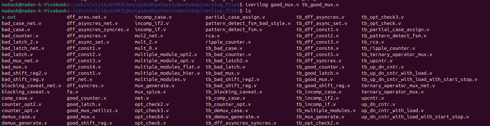

now an executable called a.out is created.

run a.out to generate the vcd file

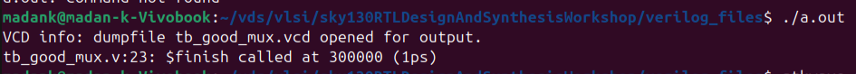

then using gtkwave, view the waveform.

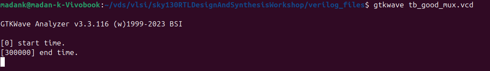

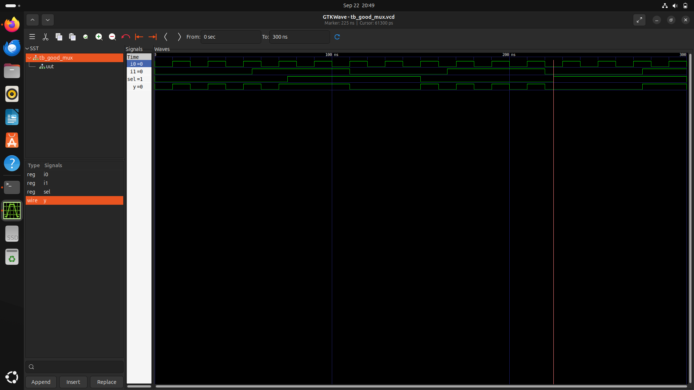

full screen:
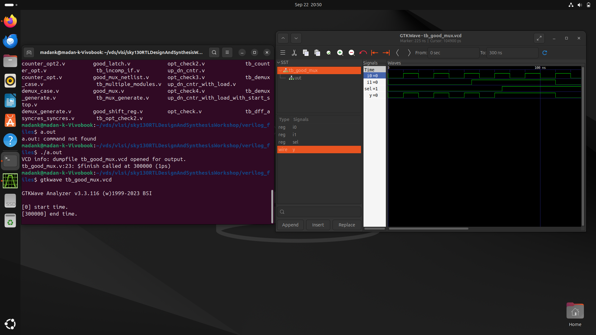

# 3. Introduction to Yosys and Logic synthesis

Yosys is used to perform the logic synthesis for our design.

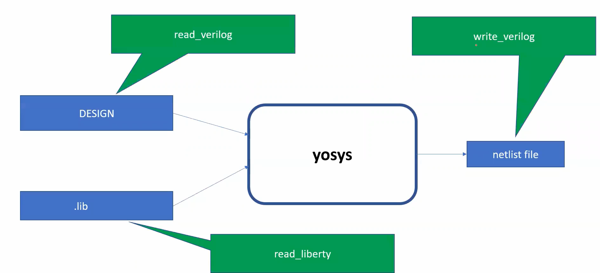

It generates the netlist using the design file and library file

# 4. Lab Using Yosys and Sky130 PDKs

Yosys tool is used to perform logic synthesis.

**Step 1**: Invoke Yosys
```
yosys
```
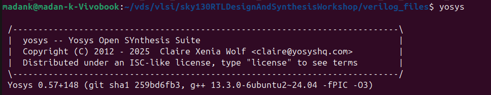


**Step 2**: read the liberty (.lib) file
```
read_liberty -lib ../lib/sky130_fd_sc_hd__tt_025C_1v80.lib
```

**Step 3**: read the verilog design (.v) file
```
read_verilog good_mux.v
```
**Step 4**: synthesize the top level module (technology mapping is not done yet).
```
synth -top good_mux
```

**Step 5**: view the unmapped netlist
```
show
```

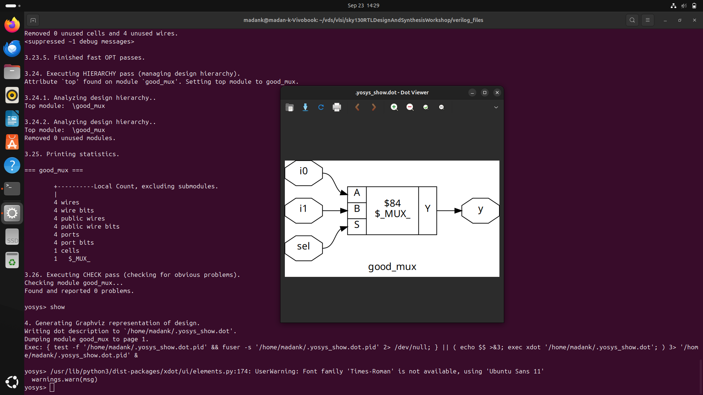

**Step 6**: Mapping RTL to Standard cells
```
abc -liberty ../lib/sky130_fd_sc_hd__tt_025C_1v80.lib
```
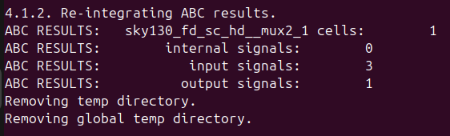

**Step 7**: view the mapped netlist
```
show
```
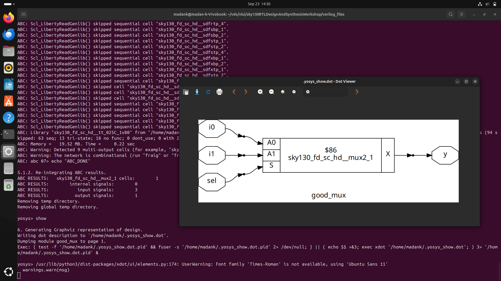

**Step 8**: writing a synthesized netlist to verilog file 
```
write_verilog  good_mux_netlist.v
```
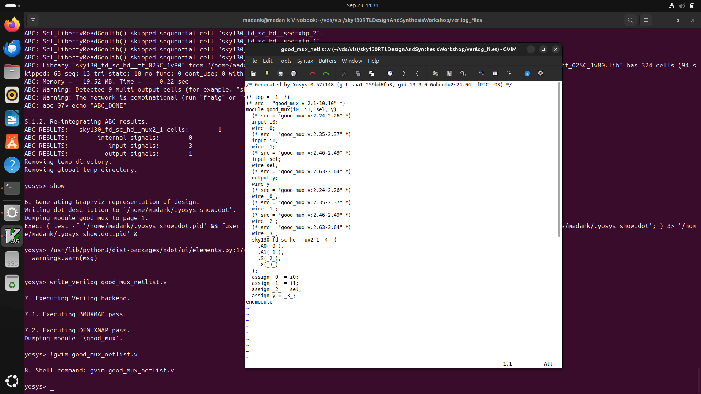

**Step 9**: writing a synthesized netlist to verilog file without attributes
```
write_verilog -noattr good_mux_netlist.v
```
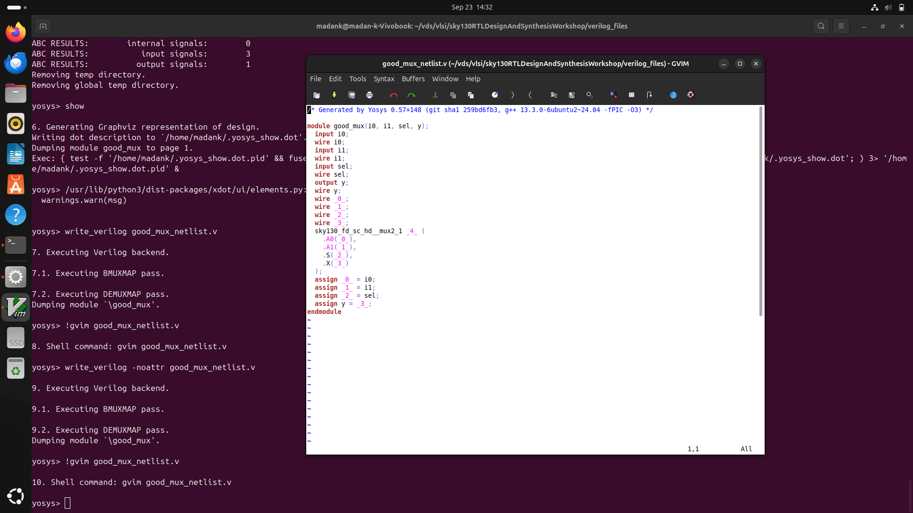


