# Day 3 - Combinational and Sequential Optimizations

## 1. Introduction to Optimizations

There are two types of optimizations: **combinational** and **sequential**.


## Combinational Optimization

* Focus: squeeze logic to get optimized design.
* Optimizes in terms of **area** and **power**.
* Two types: **constant propagation** and **boolean logic optimization**.

### Constant Propagation

If the output of a logic circuit evaluates to a constant value, then that circuit is replaced with the constant value.

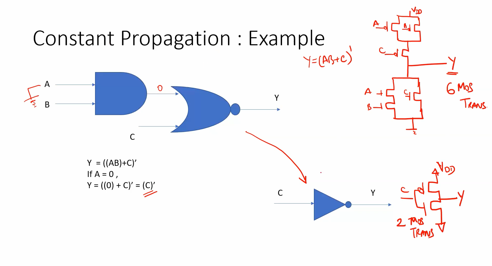

### Boolean Logic Optimization

Simplifies the boolean logic to reduce the number of gates / transistors.

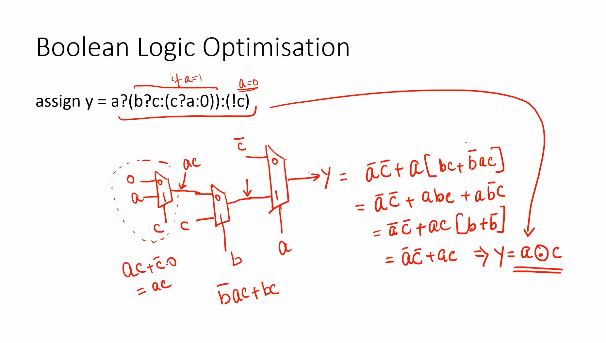


## Sequential Optimization

Types include: **sequential constant propagation, state optimization, cloning, retiming**.

### Sequential Constant Propagation

If the output of a logic circuit evaluates to a constant value, then that circuit is replaced with the constant value.

### State Optimization

Used to minimize the number of states in a sequential design.

### Cloning

Applied when long routing needs to be done in floor planning. A flip-flop with large slack is cloned.

### Retiming

Some part of the combinational circuit is moved to the other side of a flip-flop to distribute the delay and increase the operating frequency.

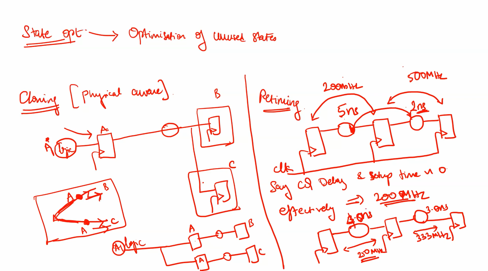


## 2. Combinational Logic Optimizations

Let us perform combinational logic optimization for some example designs:

### Design 1: opt_check.v

```
module opt_check (input a , input b , output y);
	assign y = a?b:0;
endmodule
```

### Implementation of the Design - opt_check.v

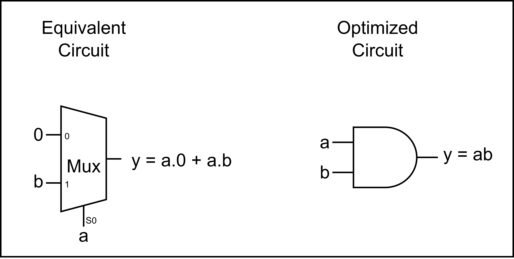

### Yosys Flow

```bash
yosys
read_liberty -lib ../lib/sky130_fd_sc_hd__tt_025C_1v80.lib
read_verilog opt_check.v 
synth -top opt_check
```

Then perform optimization:

```bash
opt_clean -purge
```

```bash
abc -liberty ../lib/sky130_fd_sc_hd__tt_025C_1v80.lib
show
```

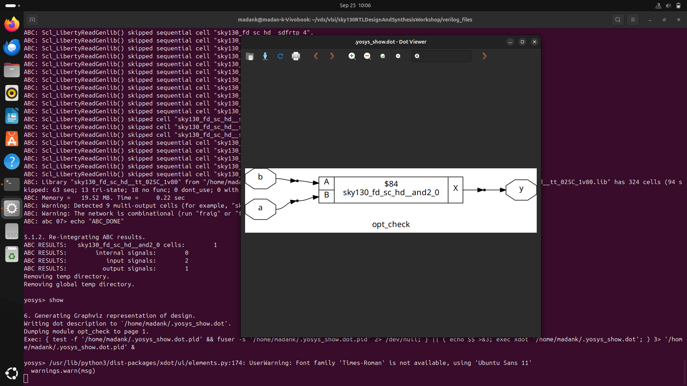

Thus the circuit is optimized.


### Design 2: opt_check2.v
```
module opt_check2 (input a , input b , output y);
	assign y = a?1:b;
endmodule
```

### Implementation of the Design - opt_check2.v

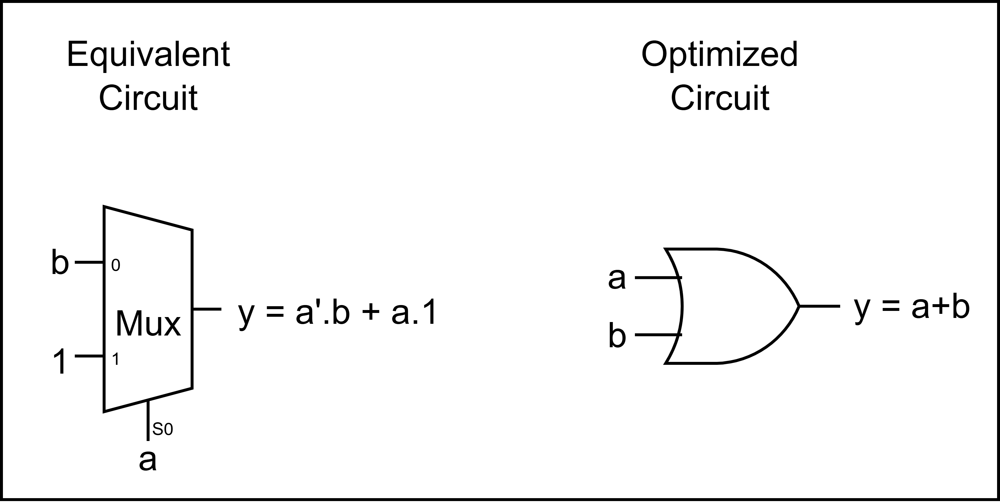

### Yosys Flow

```bash
yosys
read_liberty -lib ../lib/sky130_fd_sc_hd__tt_025C_1v80.lib
read_verilog opt_check2.v 
synth -top opt_check2
```

Then perform optimization:

```bash
opt_clean -purge
```

```bash
abc -liberty ../lib/sky130_fd_sc_hd__tt_025C_1v80.lib
show
```


Thus the circuit is optimized.


### Design 3: opt_check3.v
```
module opt_check3 (input a , input b, input c , output y);
	assign y = a?(c?b:0):0;
endmodule
```

### Implementation of the Design - opt_check3.v

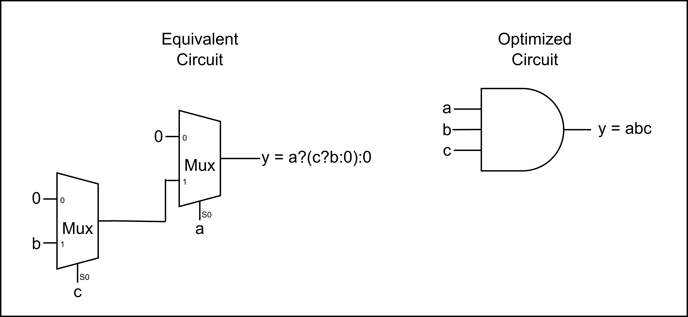

### Yosys Flow

```bash
yosys
read_liberty -lib ../lib/sky130_fd_sc_hd__tt_025C_1v80.lib
read_verilog opt_check3.v 
synth -top opt_check3
opt_clean -purge
abc -liberty ../lib/sky130_fd_sc_hd__tt_025C_1v80.lib
show
```

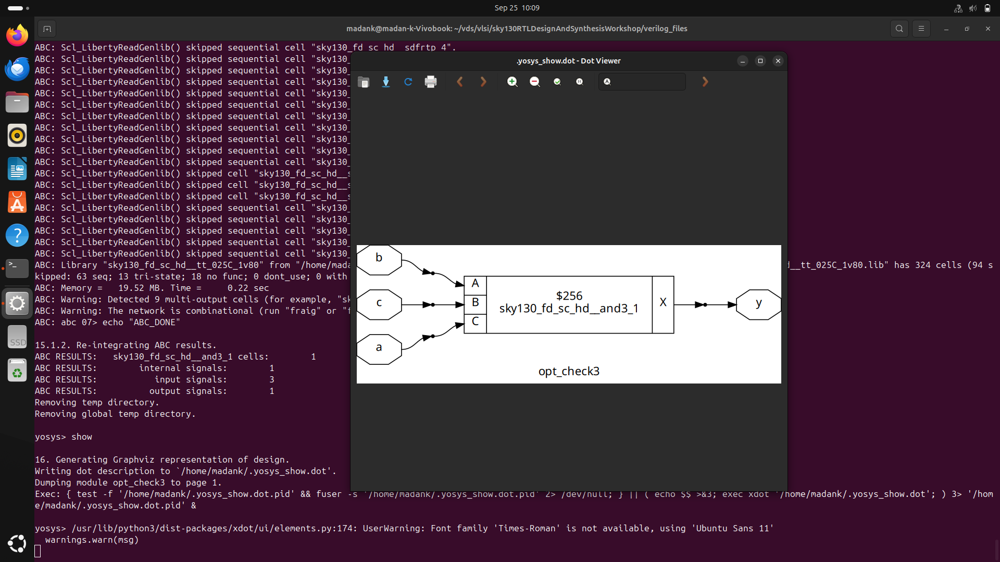

Thus the circuit is optimized.


### Design 4: opt_check4.v
```
module opt_check4 (input a , input b , input c , output y);
 assign y = a?(b?(a & c ):c):(!c);
 endmodule
```

### Implementation of the Design - opt_check4.v

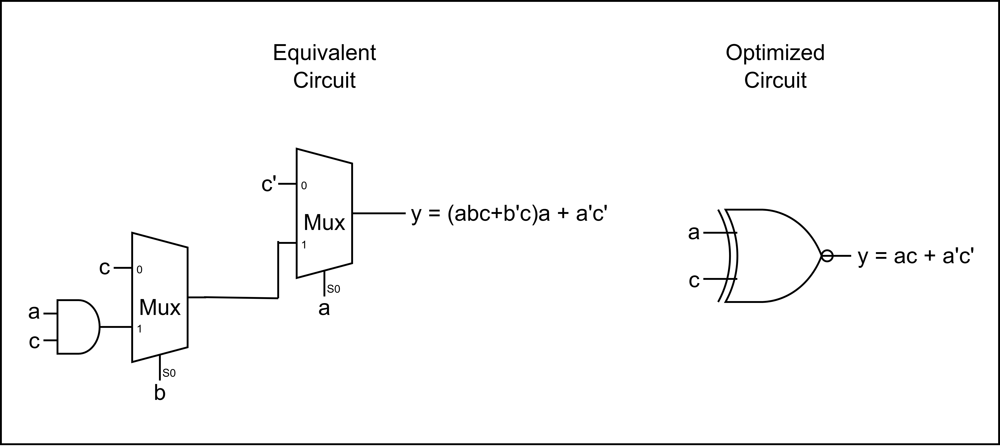

### Yosys Flow

```bash
yosys
read_liberty -lib ../lib/sky130_fd_sc_hd__tt_025C_1v80.lib
read_verilog opt_check4.v 
synth -top opt_check4
opt_clean -purge
abc -liberty ../lib/sky130_fd_sc_hd__tt_025C_1v80.lib
show
```

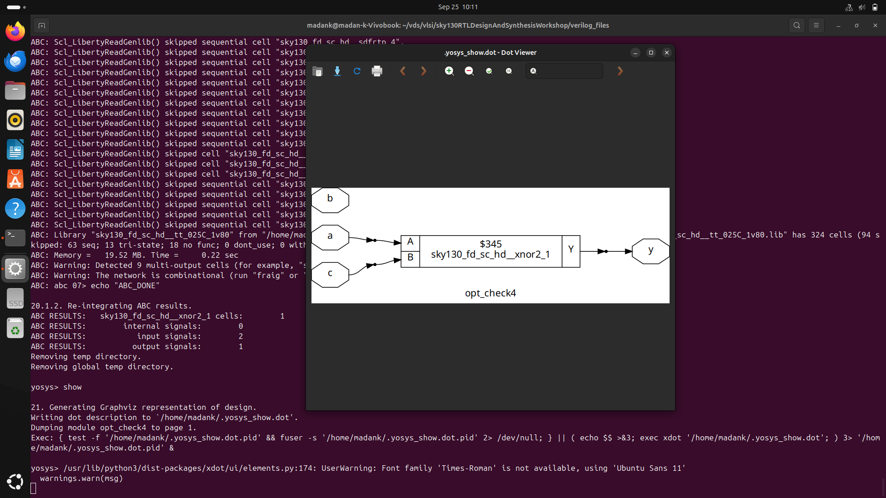

Thus the circuit is optimized.


### Design 5: multiple_module_opt.v
```
module sub_module1(input a , input b , output y);
 assign y = a & b;
endmodule


module sub_module2(input a , input b , output y);
 assign y = a^b;
endmodule


module multiple_module_opt(input a , input b , input c , input d , output y);
wire n1,n2,n3;

sub_module1 U1 (.a(a) , .b(1'b1) , .y(n1));
sub_module2 U2 (.a(n1), .b(1'b0) , .y(n2));
sub_module2 U3 (.a(b), .b(d) , .y(n3));

assign y = c | (b & n1); 


endmodule
```

### Yosys Flow

```bash
yosys
read_liberty -lib ../lib/sky130_fd_sc_hd__tt_025C_1v80.lib
read_verilog multiple_module_opt.v 
synth -top multiple_module_opt
flatten
opt_clean -purge
abc -liberty ../lib/sky130_fd_sc_hd__tt_025C_1v80.lib
show
```

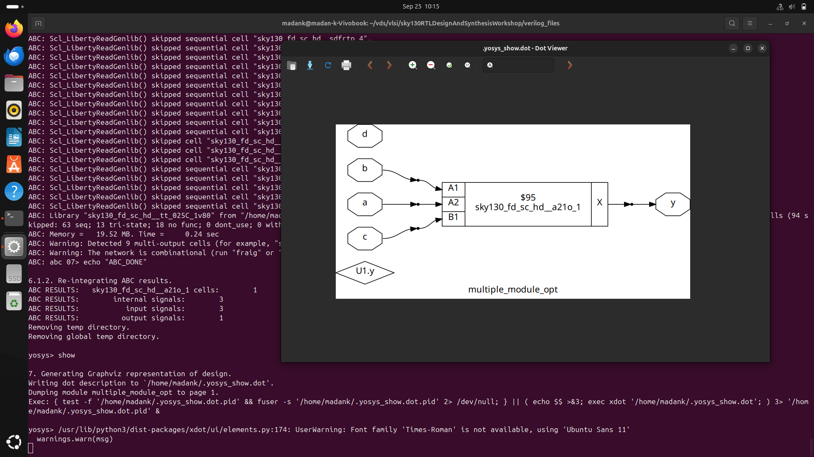

Thus the circuit is optimized.


### Design 6: multiple_module_opt2.v
```
module sub_module(input a , input b , output y);
 assign y = a & b;
endmodule


module multiple_module_opt2(input a , input b , input c , input d , output y);
wire n1,n2,n3;

sub_module U1 (.a(a) , .b(1'b0) , .y(n1));
sub_module U2 (.a(b), .b(c) , .y(n2));
sub_module U3 (.a(n2), .b(d) , .y(n3));
sub_module U4 (.a(n3), .b(n1) , .y(y));


endmodule
```

### Yosys Flow

```bash
yosys
read_liberty -lib ../lib/sky130_fd_sc_hd__tt_025C_1v80.lib
read_verilog multiple_module_opt2.v 
synth -top multiple_module_opt2
flatten 
opt_clean -purge
abc -liberty ../lib/sky130_fd_sc_hd__tt_025C_1v80.lib
show
```

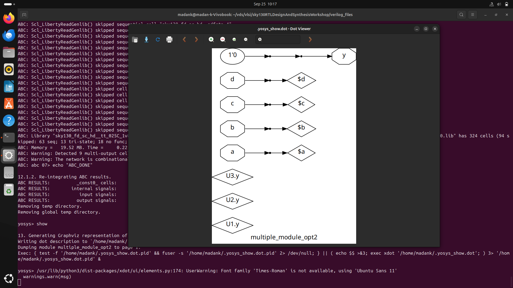

Thus the circuit is optimized.


## 3. Sequential Logic Optimizations

Sequential logic optimization can be understood using the following example designs:

### dff_const1.v

```
module dff_const1(input clk, input reset, output reg q);
always @(posedge clk, posedge reset)
begin
	if(reset)
		q <= 1'b0;
	else
		q <= 1'b1;
end

endmodule
```

#### Equivalent Circuit Implementation

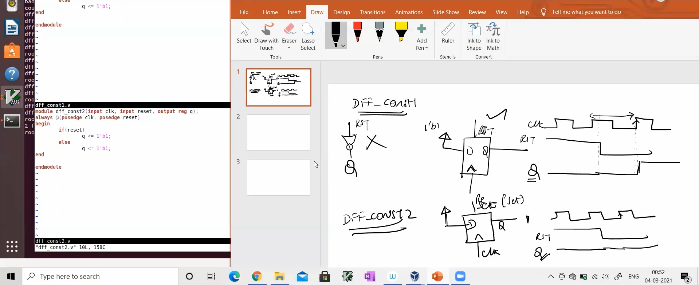

#### Simulation using Iverilog and GTKWave

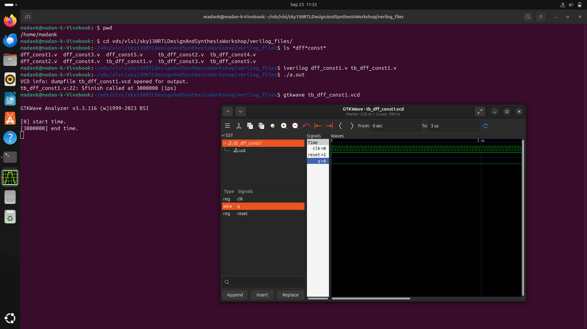

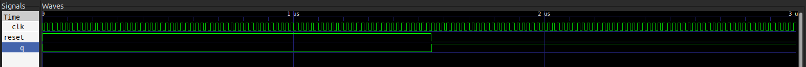

#### Yosys Flow

```bash
yosys
read_liberty -lib ../lib/sky130_fd_sc_hd__tt_025C_1v80.lib
read_verilog dff_const1.v  
synth -top dff_const1
dfflibmap -liberty ../lib/sky130_fd_sc_hd__tt_025C_1v80.lib 
abc -liberty ../lib/sky130_fd_sc_hd__tt_025C_1v80.lib
show
```

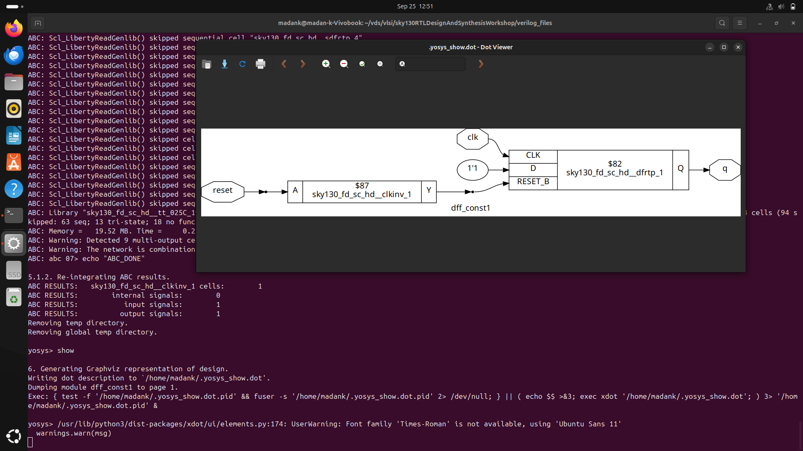


### dff_const2.v

```
module dff_const2(input clk, input reset, output reg q);
always @(posedge clk, posedge reset)
begin
	if(reset)
		q <= 1'b1;
	else
		q <= 1'b1;
end

endmodule
```

#### Simulation using Iverilog and GTKWave

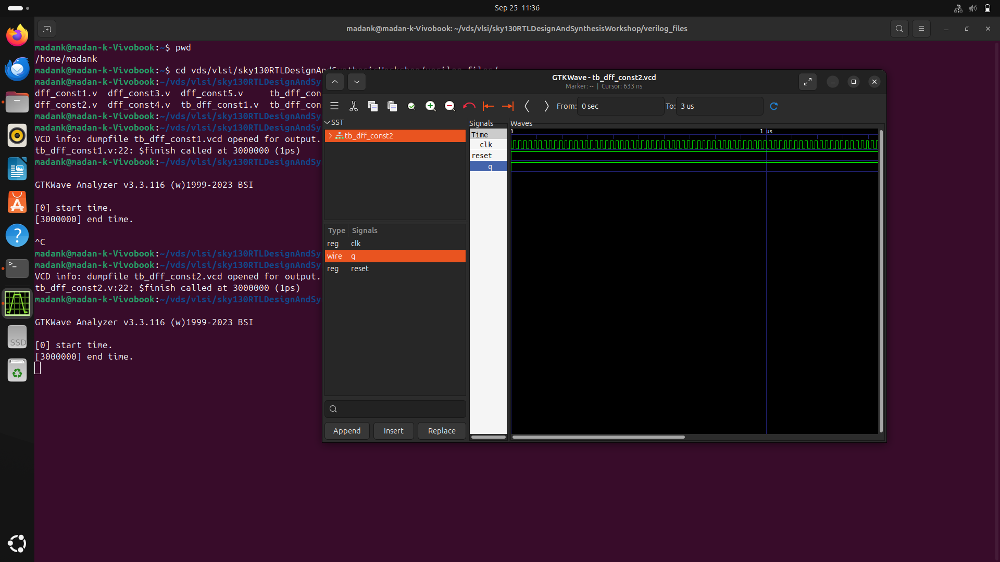

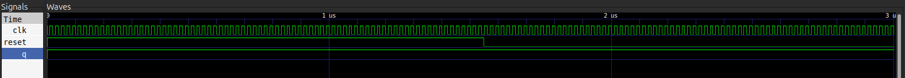

#### Yosys Flow

```bash
yosys
read_liberty -lib ../lib/sky130_fd_sc_hd__tt_025C_1v80.lib
read_verilog dff_const2.v  
synth -top dff_const2
dfflibmap -liberty ../lib/sky130_fd_sc_hd__tt_025C_1v80.lib 
abc -liberty ../lib/sky130_fd_sc_hd__tt_025C_1v80.lib
show
```

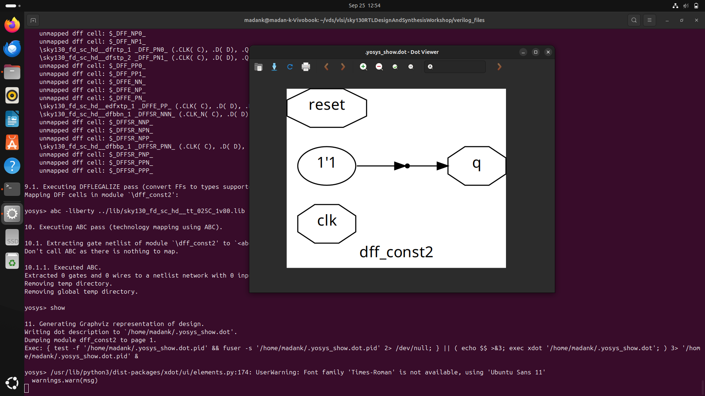


### dff_const3.v

```
module dff_const3(input clk, input reset, output reg q);
reg q1;

always @(posedge clk, posedge reset)
begin
	if(reset)
	begin
		q <= 1'b1;
		q1 <= 1'b0;
	end
	else
	begin
		q1 <= 1'b1;
		q <= q1;
	end
end

endmodule
```

#### Equivalent Circuit Implementation

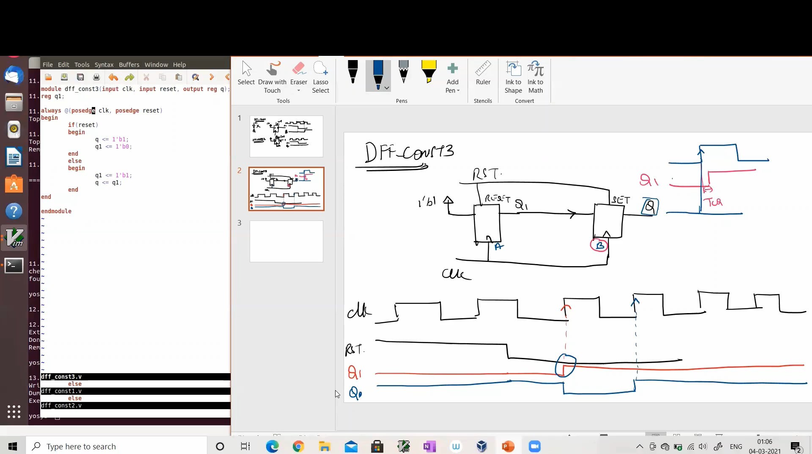

#### Simulation using Iverilog and GTKWave

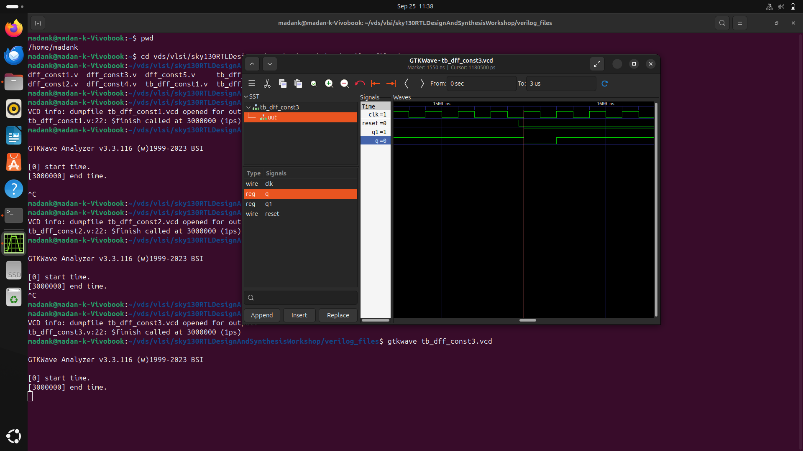


#### Yosys Flow

```bash
yosys
read_liberty -lib ../lib/sky130_fd_sc_hd__tt_025C_1v80.lib
read_verilog dff_const3.v  
synth -top dff_const3
dfflibmap -liberty ../lib/sky130_fd_sc_hd__tt_025C_1v80.lib 
abc -liberty ../lib/sky130_fd_sc_hd__tt_025C_1v80.lib
show
```

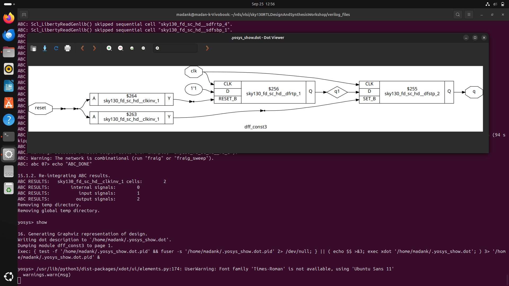


### dff_const4.v

```
module dff_const4(input clk, input reset, output reg q);
reg q1;

always @(posedge clk, posedge reset)
begin
	if(reset)
	begin
		q <= 1'b1;
		q1 <= 1'b1;
	end
	else
	begin
		q1 <= 1'b1;
		q <= q1;
	end
end

endmodule
```

#### Simulation using Iverilog and GTKWave

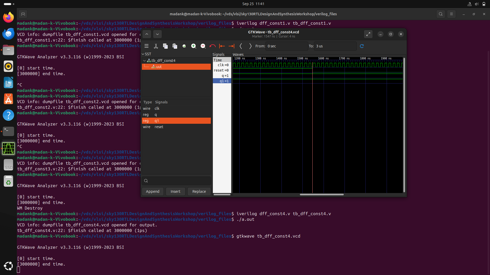

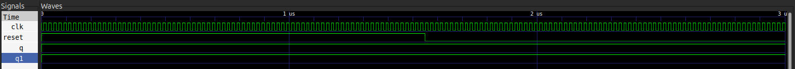

#### Yosys Flow

```bash
yosys
read_liberty -lib ../lib/sky130_fd_sc_hd__tt_025C_1v80.lib
read_verilog dff_const4.v  
synth -top dff_const4
dfflibmap -liberty ../lib/sky130_fd_sc_hd__tt_025C_1v80.lib 
abc -liberty ../lib/sky130_fd_sc_hd__tt_025C_1v80.lib
show
```

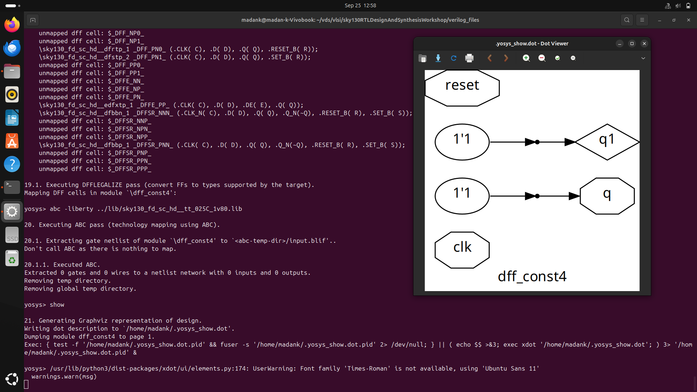


### dff_const5.v

```
module dff_const5(input clk, input reset, output reg q);
reg q1;

always @(posedge clk, posedge reset)
begin
	if(reset)
	begin
		q <= 1'b0;
		q1 <= 1'b0;
	end
	else
	begin
		q1 <= 1'b1;
		q <= q1;
	end
end

endmodule
```

#### Simulation using Iverilog and GTKWave

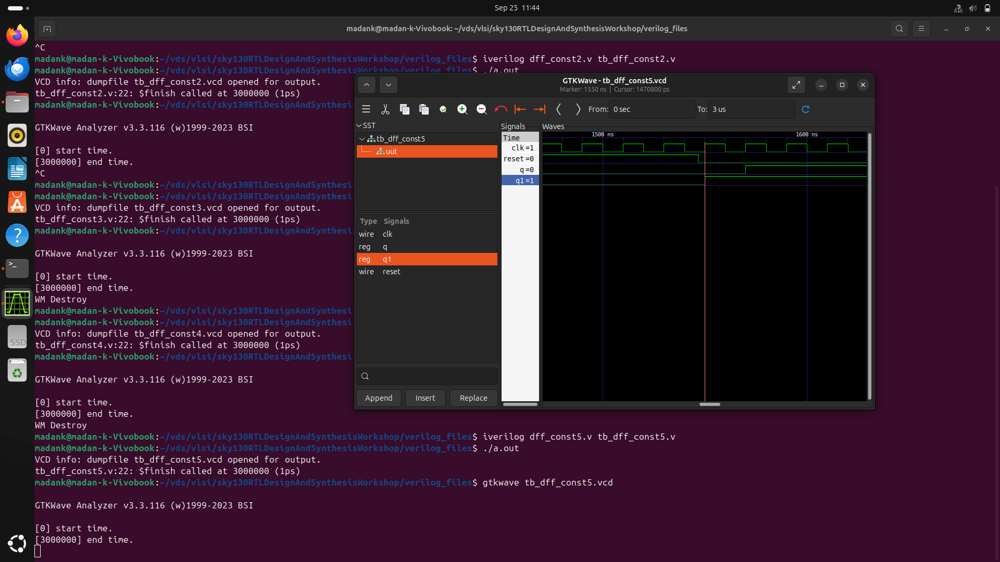

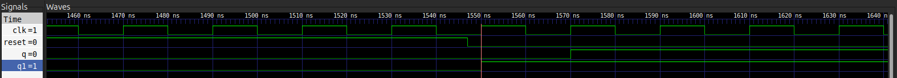

#### Yosys Flow

```bash
yosys
read_liberty -lib ../lib/sky130_fd_sc_hd__tt_025C_1v80.lib
read_verilog dff_const5.v  
synth -top dff_const5
dfflibmap -liberty ../lib/sky130_fd_sc_hd__tt_025C_1v80.lib 
abc -liberty ../lib/sky130_fd_sc_hd__tt_025C_1v80.lib
show
```

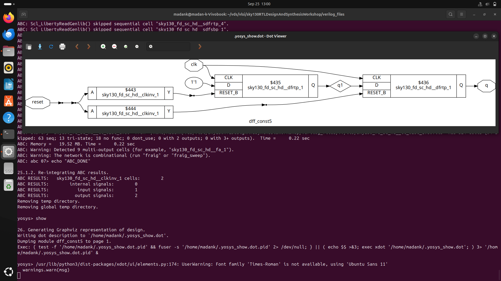


## Sequential optimzations for unused outputs

Here, the outputs which doesn't have a direct role in determining the primary output of a design is optimized.

Consider the design counter_opt.v:
```
module counter_opt (input clk , input reset , output q);
reg [2:0] count;
assign q = count[0];

always @(posedge clk ,posedge reset)
begin
	if(reset)
		count <= 3'b000;
	else
		count <= count + 1;
end

endmodule
```

Here, the bit count[0] have a direct impact on the primary output 'q' and the remaining bits count[2:1] doesn't have a direct impact on the primary output. so the optimization is done such that the flip-flops for count[2:1] is eliminated. And it is realized that the output 'q' is toggled every clock cycle. So the synthesized circuit is having only one D flip-flop:

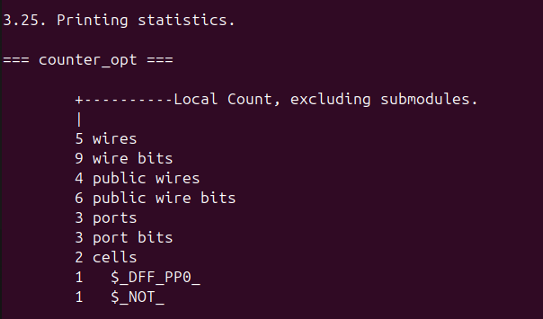

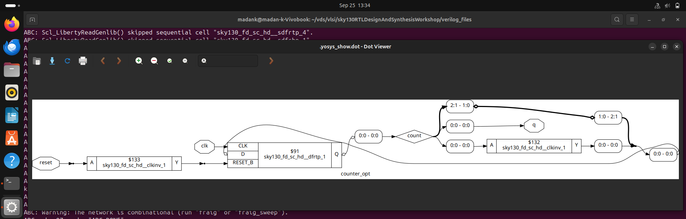


Consider the second design counter_opt2.v:
```
module counter_opt (input clk , input reset , output q);
reg [2:0] count;
assign q = (count[2:0] == 3'b100);

always @(posedge clk ,posedge reset)
begin
	if(reset)
		count <= 3'b000;
	else
		count <= count + 1;
end

endmodule
```

Here, the primary outpur 'q' is dependent on all the bits of 'count' (count[2:0]). Thus the Flip-flops associated with these bits are instantiated:

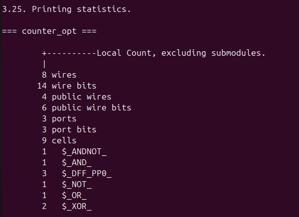

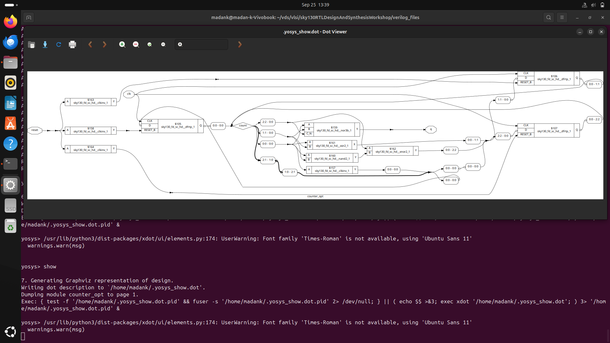

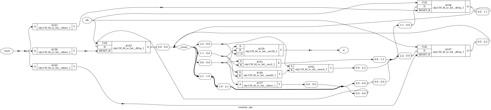
