# Day 4 - GLS, Blocking vs Non-blocking and Synthesis-Simulation Mismatch

## 1. GLS, Synthesis-Simulation Mismatch and Blocking/Non-blocking Statements

In GLS, the generated netlist is the Design under test. Since the functionality, pins and ports of the initial design and its netlist are same, we can utilize the same testbench that we have written before for initial RTL design.

GLS also ensures that the timing of design is met.

### GLS Using Iverilog

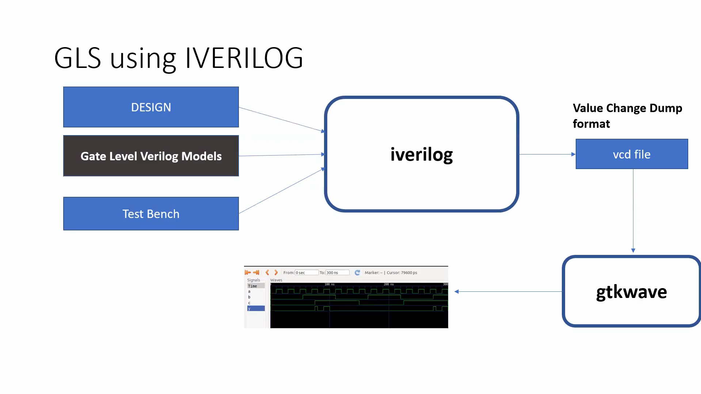

---

## Synthesis-Simulation Mismatch

Synthesis simulation mismatch occures due to the following reasons:

* Missings sensitivity list
* Incorrect use of blocking and non-blocking assignments
* non-standard verilog coding

### Missing Sensitivity List

When we write an always block with incomplete sensitivity. That is, in the below example, the code on the left evaluates the code inside always block only when 'sel' signal changes. It doesn’t evaluate the output even when input signals `i0` or `i1` changes.
But the code on the right evaluates the output whenever any of the input signal changes its value.

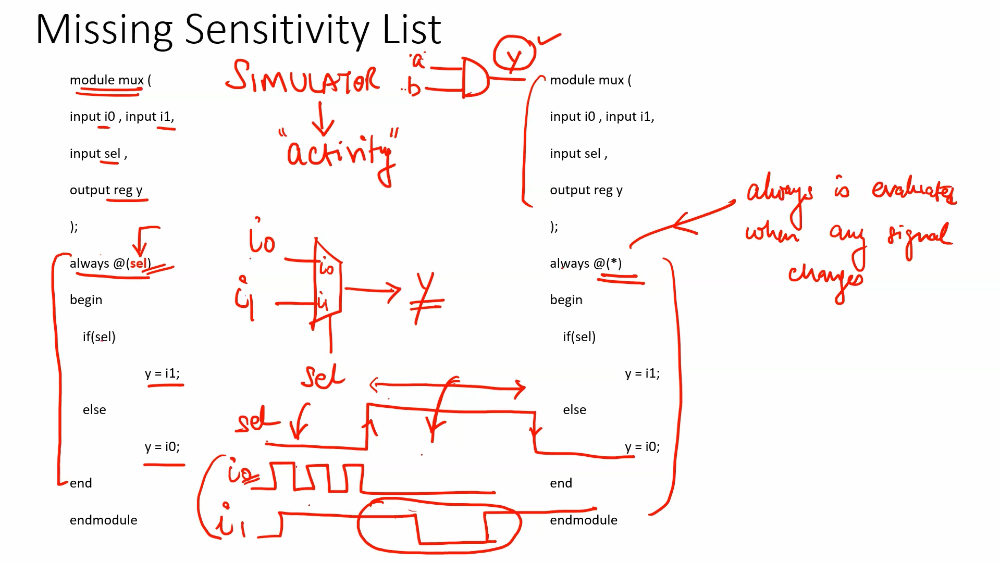

### Blocking vs Non-blocking Assignments

Sequential circuits should use non-blocking assignments.

* **Blocking statements (`=`)** are executed in the written order.
* **Non-blocking assignments (`<=`)** are executed in parallel by the following method:

  1. First the RHS of all non-blocking statements is evaluated.
  2. Then the LHS of all non-blocking statements is assigned the evaluated RHS value.

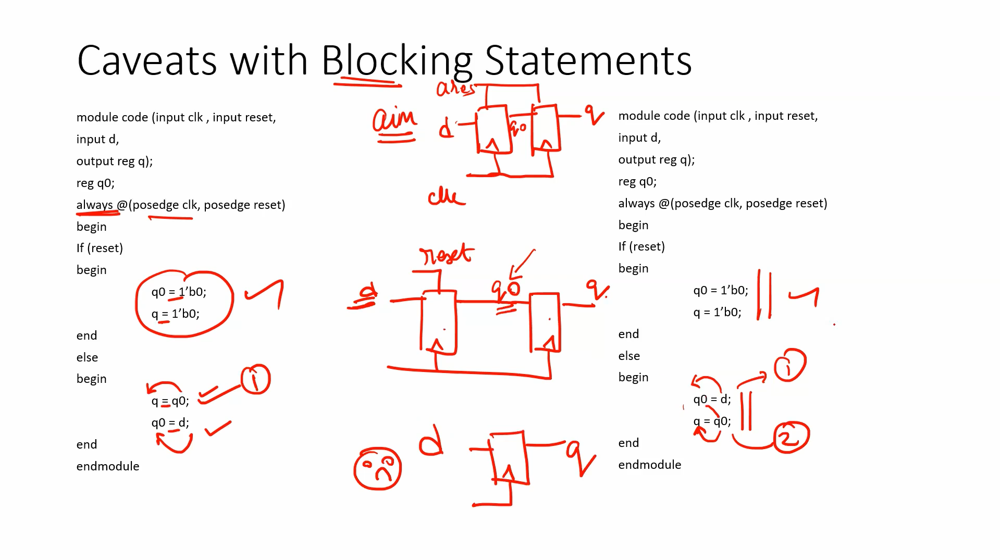

## 2. Labs on GLS and Synthesis-Simulation Mismatch

Consider the design ternary_operator_mux.v:
```
module ternary_operator_mux (input i0 , input i1 , input sel , output y);
	assign y = sel?i1:i0;
endmodule
```

Now, let us obtain the simulation of our design before and after the synthesis.

#### Simulation Before Synthesis

Iverilog and gtkwave output:

```
iverilog ternary_operator_mux.v tb_ternary_operator_mux.v
./a.out
gtkwave tb_ternary_operator_mux.vcd
```

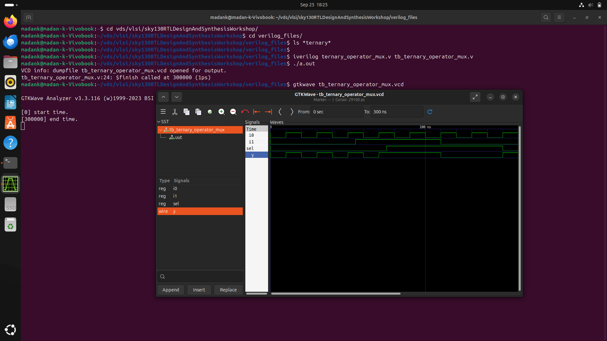


#### Synthesis using Yosys:

```
yosys
read_liberty -lib ../lib/sky130_fd_sc_hd__tt_025C_1v80.lib
read_verilog ternary_operator_mux.v
synth -top ternary_operator_mux
abc -liberty ../lib/sky130_fd_sc_hd__tt_025C_1v80.lib
write_verilog ternary_operator_mux_net.v
show
```

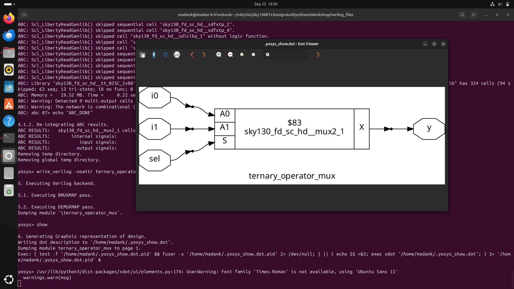


#### Simulation after Synthesis

```
iverilog ../my_lib/verilog_model/primitives.v  ../my_lib/verilog_model/sky130_fd_sc_hd.v ternary_operator_mux_net.v tb_ternary_operator_mux.v
./a.out
gtkwave tb_ternary_operator_mux.vcd
```

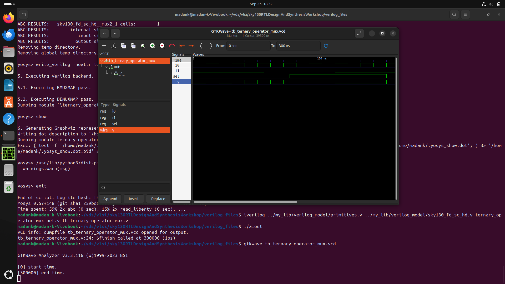


#### Comparing simulation results:

before synthesis:

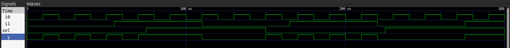

after synthesis:


Both the simulation results are same. 

#### let us see another example.


Consider the design bad_mux.v:
```
module bad_mux (input i0 , input i1 , input sel , output reg y);
always @ (sel)
begin
	if(sel)
		y <= i1;
	else 
		y <= i0;
end
endmodule
```

Now, let us obtain the simulation of our design before and after the synthesis.

#### Simulation Before Synthesis

Iverilog and gtkwave output:

```
iverilog bad_mux.v tb_bad_mux.v
./a.out
gtkwave tb_bad_mux.vcd
```

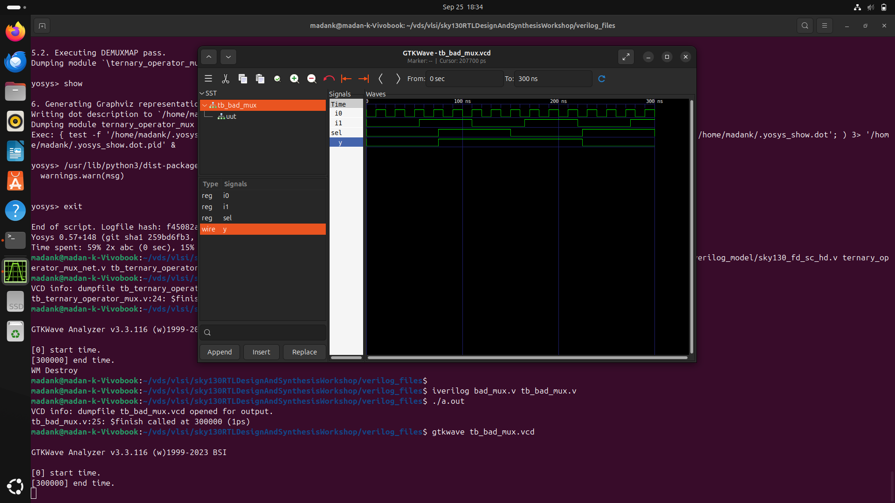


#### Synthesis using Yosys:

```
yosys
read_liberty -lib ../lib/sky130_fd_sc_hd__tt_025C_1v80.lib
read_verilog bad_mux.v
synth -top bad_mux
abc -liberty ../lib/sky130_fd_sc_hd__tt_025C_1v80.lib
write_verilog bad_mux_net.v
show
```

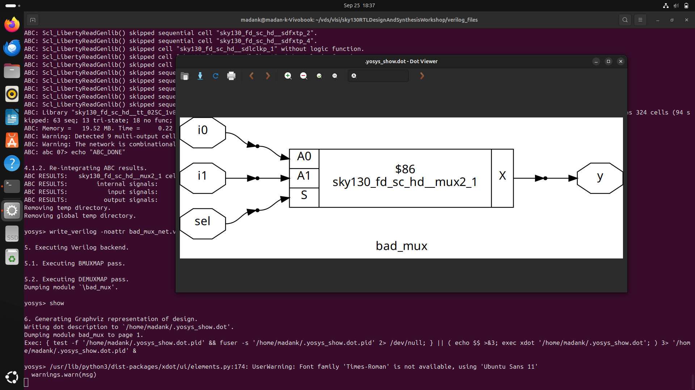


#### Simulation after Synthesis

```
iverilog ../my_lib/verilog_model/primitives.v  ../my_lib/verilog_model/sky130_fd_sc_hd.v bad_mux_net.v tb_bad_mux.v
./a.out
gtkwave bad_mux.vcd
```

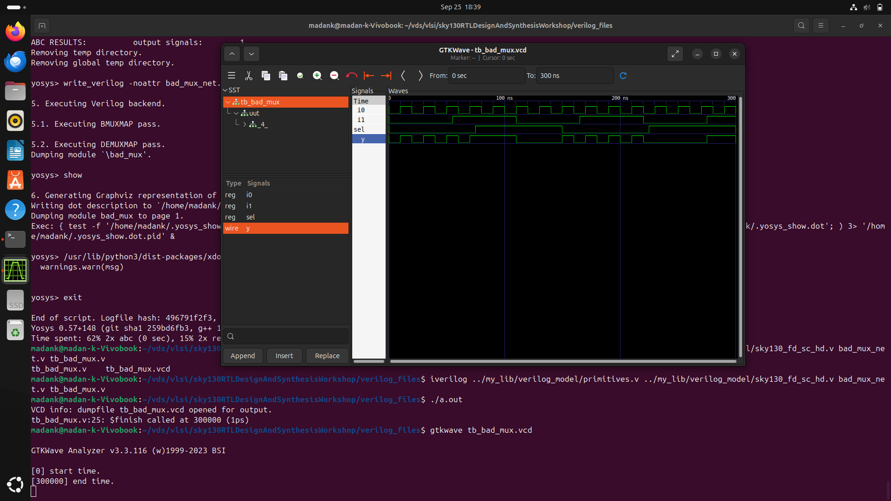


#### Comparing simulation results:

before synthesis:

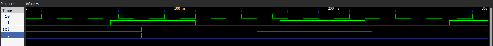

after synthesis:


Both the simulation results are not same. The output of the multiplexer before synthesis, changes only when the 'sel' signal changes its value. But in the simulation of its netlist, the output signal changes its value whenever any of the input signal (i0,i1 or sel) changes its value.

This shows the synth-sim mismatch.

## 3. Labs on synth-sim mismatch for blocking statement

Consider the design file blocking_caveat.v:
```
module blocking_caveat (input a , input b , input  c, output reg d); 
reg x;
always @ (*)
begin
	d = x & c;
	x = a | b;
end
endmodule
```

The expected netlist is given below:

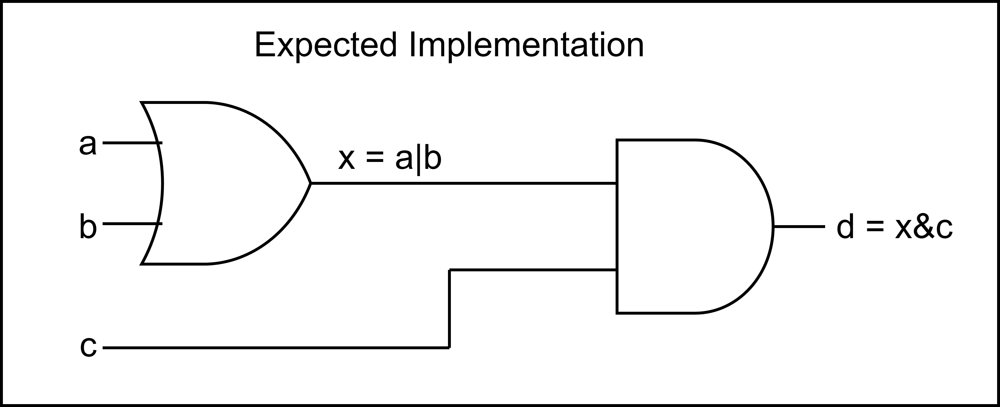


#### Simulation Before Synthesis

Iverilog and gtkwave output:

```
iverilog blocking_caveat.v tb_blocking_caveat.v
./a.out
gtkwave tb_blocking_caveat.vcd
```

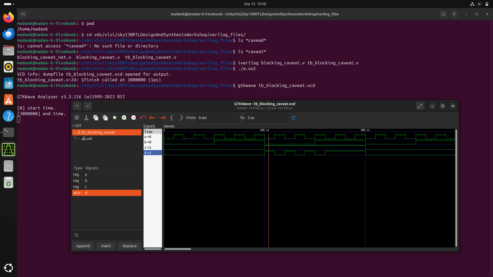


#### Synthesis using Yosys:

```
yosys
read_liberty -lib ../lib/sky130_fd_sc_hd__tt_025C_1v80.lib
read_verilog blocking_caveat.v
synth -top blocking_caveat
abc -liberty ../lib/sky130_fd_sc_hd__tt_025C_1v80.lib
write_verilog blocking_caveat_net.v
show
```

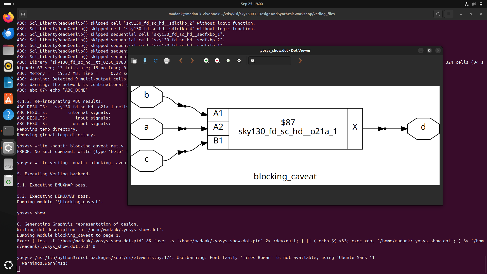


#### Simulation after Synthesis

```
iverilog ../my_lib/verilog_model/primitives.v ../my_lib/verilog_model/sky130_fd_sc_hd.v blocking_caveat_net.v tb_blocking_caveat.v
./a.out
gtkwave tb_blocking_caveat.v
```

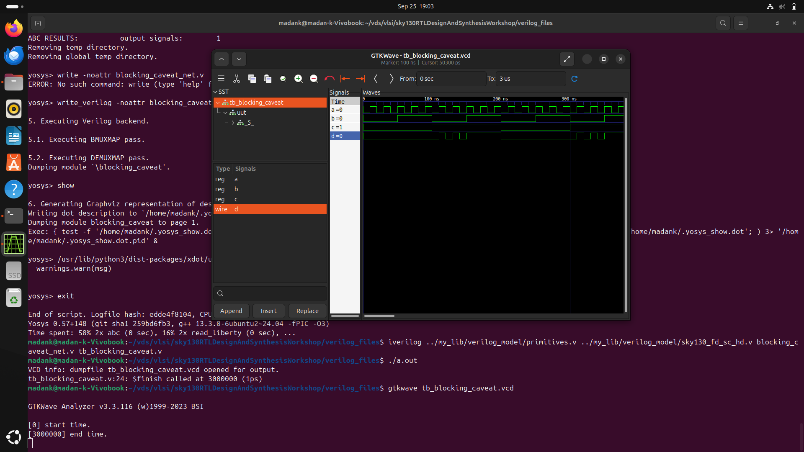


#### Comparing simulation results:

before synthesis:


after synthesis:

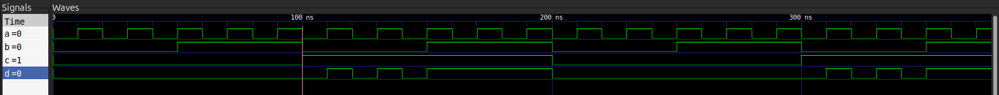

The output of the design before synthesis depends on the past values of 'x'. This mimics the flop behavior.
However the output of the synthesized netlist is dependent only on the present values of 'x'. 

This shows the synth-sim mismatch for blocking statement.
