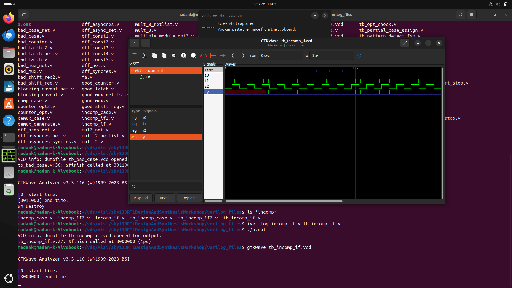
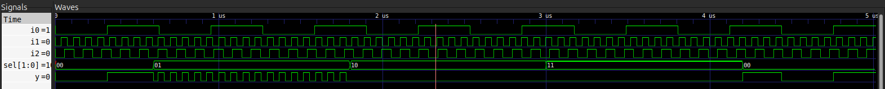
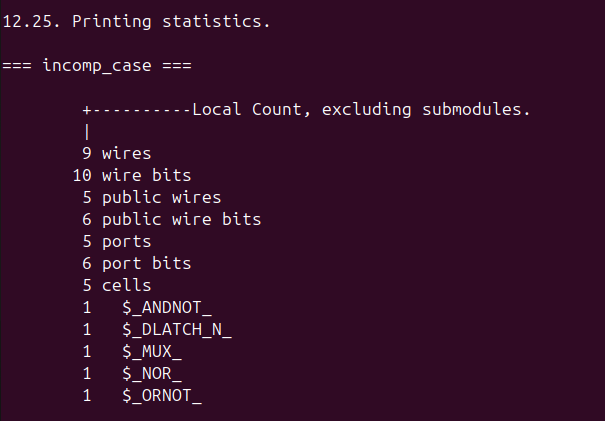

# Day 5 - Optimization in Synthesis

## 1. If Case Constructs

If-else statements should be approached with care in digital design because they are usually synthesized to multiplexers. Incomplete if-else statements cause the synthesizer to infer latches to retain old values when none of the conditions holds. Inferred latches tend to be bad, as they could lead to glitches and timing issues. To avoid this, all possible conditions should be explicitly addressed or default values should be assigned. Well-structured if-else statements create  combinational logic with no undesired storage elements.


The same applies to incomplete case statements, which don't have default cases or has incomplete assignments inside case conditions.


## 2. Labs on "Incomplete If Case"

#### For the below incomplete if design:
```
module incomp_if (input i0 , input i1 , input i2 , output reg y);
    always @ (*)
    begin
        if(i0)
            y <= i1;
    end
endmodule
```
The output y changes only when input i0 is high. Other times, the output retains its previous values.

Iverilog and gtkwave output:

```
iverilog incomp_if.v tb_incomp_if.v
./a.out 
gtkwave tb_incomp_if.vcd
```




Yosys Synthesis:

```
yosys
read_liberty -lib ../lib/sky130_fd_sc_hd__tt_025C_1v80.lib
read_verilog incomp_if.v
synth -top incomp_if
```


```
abc -liberty ../lib/sky130_fd_sc_hd__tt_025C_1v80.lib
show
```


Thus, a latch is inferred due to the incomplete if case.


#### Also, For the below incomp_if2.v design:
```
module incomp_if2 (input i0 , input i1 , input i2 , input i3, output reg y);
    always @ (*) begin
        if(i0)
            y <= i1;
        else if (i2)
            y <= i3;
    end
endmodule
```
The output y changes only when input i0 or i2 is high. Other cases, like when both i0 and i1 are zero, the output retains its pervious values.

Iverilog and gtkwave output:

```
iverilog incomp_if2.v tb_incomp_if2.v
./a.out 
gtkwave tb_incomp_if2.vcd
```


Yosys Synthesis:

```
yosys
read_liberty -lib ../lib/sky130_fd_sc_hd__tt_025C_1v80.lib
read_verilog incomp_if2.v
synth -top incomp_if2
```


```
abc -liberty ../lib/sky130_fd_sc_hd__tt_025C_1v80.lib
show
```


## 3. Labs on "Incomplete overlapping Case"

#### For the below incomp_case.v design:
```
module incomp_case (input i0 , input i1 , input i2 , input [1:0] sel, output reg y);
    always @ (*) begin
        case(sel)
            2'b00 : y = i0;
            2'b01 : y = i1;
        endcase
    end
endmodule
```
Here, only two cases 2'b00 and 2'b01 are covered. when the 'sel' signal's value changes to other values (2'b10 or 2'b11), the output 'y' gets latched to its previous value.

Iverilog and gtkwave output:

```
iverilog incomp_case.v incomp_case.v
./a.out 
gtkwave tb_incomp_case.vcd
```




Yosys Synthesis:

```
yosys
read_liberty -lib ../lib/sky130_fd_sc_hd__tt_025C_1v80.lib
read_verilog incomp_case.v
synth -top incomp_case
```



```
abc -liberty ../lib/sky130_fd_sc_hd__tt_025C_1v80.lib
show
```


#### Also, for the below comp_case.v design:
```
module comp_case (input i0 , input i1 , input i2 , input [1:0] sel, output reg y);
    always @ (*) begin
        case(sel)
            2'b00 : y = i0;
            2'b01 : y = i1;
            default : y = i2;
        endcase
    end
endmodule
```
The case statement is complete as all the conditions are specified and default condition is specified.

Iverilog and gtkwave output:

```
iverilog comp_case.v tb_comp_case.v
./a.out 
gtkwave tb_comp_case.vcd
```


Yosys Synthesis:

```
yosys
read_liberty -lib ../lib/sky130_fd_sc_hd__tt_025C_1v80.lib
read_verilog comp_case.v
synth -top comp_case
```


```
abc -liberty ../lib/sky130_fd_sc_hd__tt_025C_1v80.lib
show
```


#### Consider the given design partial_case_assign.v :

```
module partial_case_assign (input i0 , input i1 , input i2 , input [1:0] sel, output reg y , output reg x);
    always @ (*) begin
        case(sel)
            2'b00 : begin
                y = i0;
                x = i2;
                end
            2'b01 : y = i1;
            default : begin
                    x = i1;
                y = i2;
                end
        endcase
    end
endmodule
```
Here only one output (y) out of two (x,y), is assigned a value for the case 2'b01. thus the value of output 'x' latches to the previous value of 'x'. 

Iverilog and gtkwave output:

```
iverilog partial_case_assign.v tb_partial_case_assign.v
./a.out 
gtkwave tb_partial_case_assign.vcd
```


Yosys Synthesis:

```
yosys
read_liberty -lib ../lib/sky130_fd_sc_hd__tt_025C_1v80.lib
read_verilog partial_case_assign.v
synth -top partial_case_assign
```


```
abc -liberty ../lib/sky130_fd_sc_hd__tt_025C_1v80.lib
show
```


#### Also, consider the given design bad_case.v :

```
module bad_case (input i0 , input i1, input i2, input i3 , input [1:0] sel, output reg y);
    always @(*) begin
        case(sel)
            2'b00: y = i0;
            2'b01: y = i1;
            2'b10: y = i2;
            2'b1?: y = i3;
            //2'b11: y = i3;
        endcase
    end
endmodule
```
The cases 2'b10 and 2'b1? overlap eachother. This is undesirable as the output may unstable or undesirable.

Iverilog and gtkwave output:

```
iverilog bad_case.v tb_bad_case.v
./a.out 
gtkwave tb_bad_case.vcd
```


Yosys Synthesis:

```
yosys
read_liberty -lib ../lib/sky130_fd_sc_hd__tt_025C_1v80.lib
read_verilog bad_case.v
synth -top bad_case
```


```
abc -liberty ../lib/sky130_fd_sc_hd__tt_025C_1v80.lib
show
```


## 4. for loop and for generate

for-loop and for-generate are loops in verilog. Eventhough they look the same, they have their own differences.

#### For loop: 
It is used for multiple evaluation and is used inside the 'always' block.

syntax: 
```
always @(*) begin
    for(int i=start; i<end; i++) begin
        // evaluation
    end
end
```

#### generate-for
It is used for hardware replication and cannot be used inside the 'always' block. 

A single harddware can be instantiated multiple times.

syntax:
```
genvar i;  //generate variable
generate
    for (i = start; i < end; i = i + step) begin : label_name
        // Hardware replication
    end
endgenerate
```


## 5. Labs on "for loop" and "for generate"

### Consider the design mux_generate.v 
```
module mux_generate (input i0 , input i1, input i2 , input i3 , input [1:0] sel  , output reg y);
    wire [3:0] i_int;
    assign i_int = {i3,i2,i1,i0};
    integer k;
    always @ (*) begin
        for(k = 0; k < 4; k=k+1) begin
            if(k == sel)
                y = i_int[k];
        end
    end
endmodule
```
Here, for loop is used inside always block to implement the hardware. 

#### Simulation using Iverilog and gtkwave 

```
iverilog mux_generate.v tb_mux_generate.v
./a.out
gtkwave tb_mux_generate.vcd
```


#### Yosys Synthesis
```
yosys
read_liberty -lib ../lib/sky130_fd_sc_hd__tt_025C_1v80.lib
read_verilog mux_generate.v
synth -top mux_generate
abc -liberty ../lib/sky130_fd_sc_hd__tt_025C_1v80.lib
write_verilog -noattr mux_generate_net.v
show
```


#### GLS using Iverilog and gtkwave
```
iverilog ../my_lib/verilog_model/primitives.v ../my_lib/verilog_model/sky130_fd_sc_hd.v mux_generate_net.v tb_mux_generate.v
./a.out
gtkwave tb_mux_generate.vcd
```


### Consider the design demux_case.v 
```
module demux_case (output o0 , output o1, output o2 , output o3, output o4, output o5, output o6 , output o7 , input [2:0] sel  , input i);
    reg [7:0]y_int;
    assign {o7,o6,o5,o4,o3,o2,o1,o0} = y_int;
    integer k;
    always @ (*) begin
        y_int = 8'b0;
        for(k = 0; k < 8; k++) begin
            if(k == sel)
                y_int[k] = i;
        end
    end
endmodule
```
Here, for loop is used inside always block to implement the hardware. 

#### Simulation using Iverilog and gtkwave 

```
iverilog demux_case.v tb_demux_case.v
./a.out
gtkwave tb_demux_case.vcd
```


#### Yosys Synthesis
```
yosys
read_liberty -lib ../lib/sky130_fd_sc_hd__tt_025C_1v80.lib
read_verilog demux_case.v
synth -top demux_case
abc -liberty ../lib/sky130_fd_sc_hd__tt_025C_1v80.lib
write_verilog -noattr demux_case_net.v
show
```


#### GLS using Iverilog and gtkwave
```
iverilog ../my_lib/verilog_model/primitives.v ../my_lib/verilog_model/sky130_fd_sc_hd.v demux_case_net.v tb_demux_case.v
./a.out
gtkwave tb_demux_case.vcd
```


### Consider the design demux_generate.v 
```
module demux_generate (output o0 , output o1, output o2 , output o3, output o4, output o5, output o6 , output o7 , input [2:0] sel  , input i);
    reg [7:0]y_int;
    assign {o7,o6,o5,o4,o3,o2,o1,o0} = y_int;
    integer k;
    always @ (*) begin
        y_int = 8'b0;
        for(k = 0; k < 8; k++) begin
            if(k == sel)
                y_int[k] = i;
        end
    end
endmodule
```
Here, for loop is used inside always block to implement the hardware. 

#### Simulation using Iverilog and gtkwave 

```
iverilog demux_generate.v tb_demux_generate.v
./a.out
gtkwave tb_demux_generate.vcd
```


#### Yosys Synthesis
```
yosys
read_liberty -lib ../lib/sky130_fd_sc_hd__tt_025C_1v80.lib
read_verilog demux_generate.v
synth -top demux_generate
abc -liberty ../lib/sky130_fd_sc_hd__tt_025C_1v80.lib
write_verilog -noattr demux_generate_net.v
show
```


#### GLS using Iverilog and gtkwave
```
iverilog ../my_lib/verilog_model/primitives.v ../my_lib/verilog_model/sky130_fd_sc_hd.v demux_generate_net.v tb_demux_generate.v
./a.out
gtkwave tb_demux_generate.vcd
```


### consider the design rca.v 
```
module rca (input [7:0] num1 , input [7:0] num2 , output [8:0] sum);
    wire [7:0] int_sum;
    wire [7:0]int_co;

    genvar i;
    generate
        for (i = 1 ; i < 8; i=i+1) begin
            fa u_fa_1 (.a(num1[i]),.b(num2[i]),.c(int_co[i-1]),.co(int_co[i]),.sum(int_sum[i]));
        end

    endgenerate

    fa u_fa_0 (.a(num1[0]),.b(num2[0]),.c(1'b0),.co(int_co[0]),.sum(int_sum[0]));


    assign sum[7:0] = int_sum;
    assign sum[8] = int_co[7];
endmodule
```

fa.v :
```
module fa (input a , input b , input c, output co , output sum);
	assign {co,sum}  = a + b + c ;
endmodule
```

Here, for loop is used inside always block to implement the hardware. 

#### Simulation using Iverilog and gtkwave 

```
iverilog fa.v rca.v tb_rca.v
./a.out
gtkwave tb_rca.vcd
```


#### Yosys Synthesis
```
yosys
read_liberty -lib ../lib/sky130_fd_sc_hd__tt_025C_1v80.lib
read_verilog rca.v
synth -top rca
abc -liberty ../lib/sky130_fd_sc_hd__tt_025C_1v80.lib
write_verilog -noattr rca_net.v
show
```


#### GLS using Iverilog and gtkwave
```
iverilog ../my_lib/verilog_model/primitives.v ../my_lib/verilog_model/sky130_fd_sc_hd.v rca_net.v tb_rca.v
./a.out
gtkwave tb_rca.vcd
```


