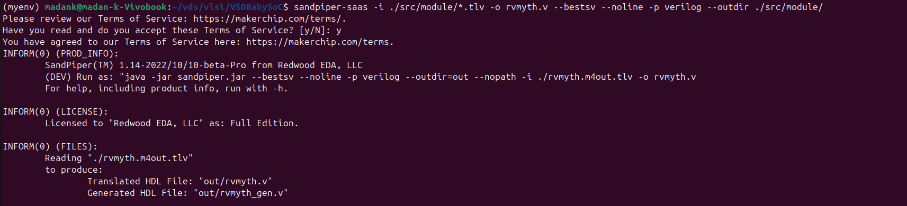
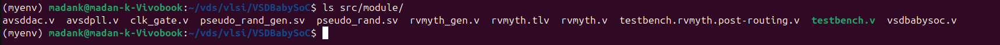
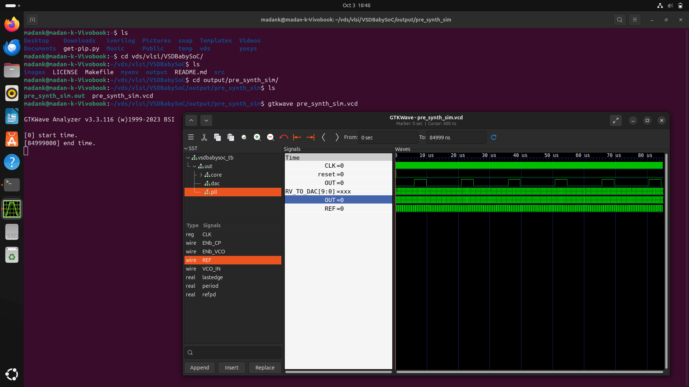
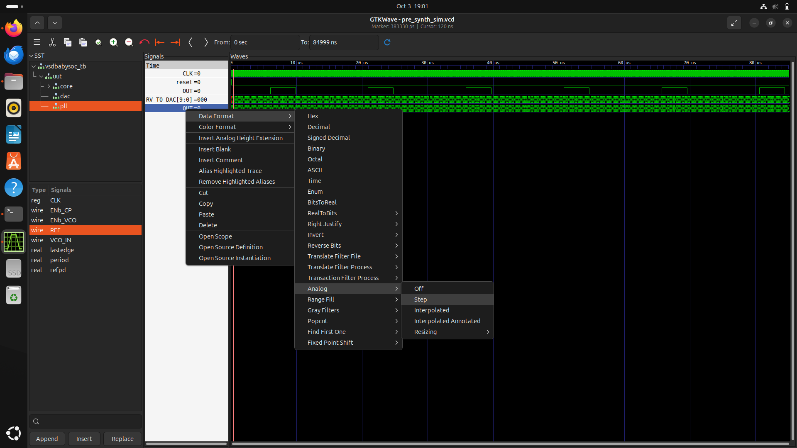
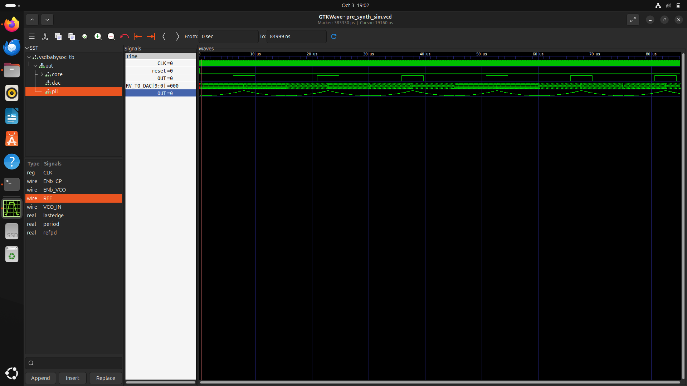
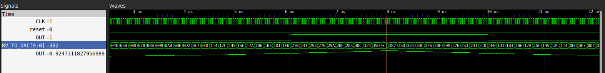
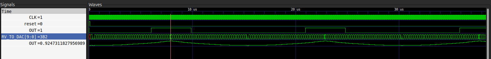
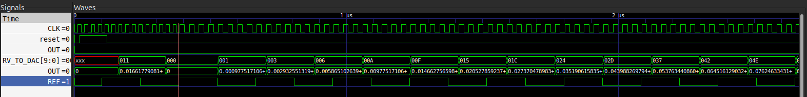

# BabySoC Fundamentals & Functional Modelling
# Part 2 – Labs (Hands-on Functional Modelling)

## Setting up Project directory

Our project directory follows this structure
```
VSDBabySoC/
├── src/
│   ├── include/
│   │   ├── sandpiper.vh
│   │   └── other header files...
│   ├── module/
│   │   ├── vsdbabysoc.v      # Top-level module integrating all components
│   │   ├── rvmyth.v          # RISC-V core module
│   │   ├── avsdpll.v         # PLL module
│   │   ├── avsddac.v         # DAC module
│   │   └── testbench.v       # Testbench for simulation
└── output/
└── compiled_tlv/         # Holds compiled intermediate files if needed
```

- **vdsbabysoc.v** is the top-level module that contains the sub-modules of RVMYTH, PLL, and DAC.
- **rvmyth.v** is the module for risc-v cpu core
- **avsdpll.v** is the PLL that provides clock signal to RVMYTH
- **avsddac.v** is the DAC that converts 10-bit Digital signal received from RVMYTH to analog signal
- **testbench.v** testbench for providing stimulus to our BabySoC

The `VSDBabySoC/output/` directory is for storing the output files such as .vcd files


## Cloning the VSDBabySoC project
Let us clone the project files to vlsi directory.

```
cd ~/vlsi
git clone https://github.com/manili/VSDBabySoC.github
```
When we list the files in `VSDBabySoC/src/module/`
```
cd ~/vlsi/VSDBabySoC/
ls VSDBabySoC/src/module/
```
we have 
```
avsddac.v  avsdpll.v  clk_gate.v  pseudo_rand_gen.sv  pseudo_rand.sv  rvmyth_gen.v  rvmyth.tlv testbench.rvmyth.post-routing.v  testbench.v  vsdbabysoc.v
```

the file for rvmyth is written in tlv (Transaction-Level Verilog (TL-Verilog)). We need to convert it to verilog file (.v)

#### Steps to convert `.tlv` file to `.v` file:

1. Install python3-venv (ignore if already installed)
```
sudo apt update
sudo apt install python3-venv python3-pip
```

2. Create a virtual environment
```
cd ~/VLSI/VSDBabySoC/
python3 -m venv myenv
```

3. Activate the virtual environment
```
source myenv/bin/activate
```

4. Install SandPiper-SaaS in virtual environment
```
pip install pyyaml click sandpiper-saas
```
5. Convert rvmyth.tlv to rvmyth.v
```
sandpiper-saas -i ./src/module/*.tlv -o rvmyth.v --bestsv --noline -p verilog --outdir ./src/module/
```



now the rvmyth.v file is created in `./src/module/`



6. Deactivate the virtual environment when not using it
```
deactivate
```

## Simulation using Iverilog and gtkwave

before simulating our design, we need to create `pre_synth_sim/` directory inside `VSDBabySoC/output/` where we store the output simulation files.

```
cd ~/vlsi/VSDBabySoC/
mkdir -p output/pre_synth_sim
```
now run simulation using Iverilog
```
iverilog -o ~/VLSI/VSDBabySoC/output/pre_synth_sim/pre_synth_sim.out -DPRE_SYNTH_SIM -I ~/VLSI/VSDBabySoC/src/include -I ~/VLSI/VSDBabySoC/src/module ~/VLSI/VSDBabySoC/src/module/testbench.v
```

`-o <file>` : Output file for the compiled simulation (pre_synth_sim.out).

`-D PRE_SYNTH_SIM` : Define a macro PRE_SYNTH_SIM for conditional compilation (ifdef PRE_SYNTH_SIM in your Verilog code).

`-I <dir>` : Include directories

`~/VLSI/VSDBabySoC/src/module/testbench.v` : The top-level Verilog file you are compiling (your testbench).

#### Waveform using gtkwave
Now view the waveform with the help of .vcd file created inside `output/pre_synth_sim/`

```
gtkwave output/pre_synth_sim/pre_synth_sim.vcd
```

In gtkwave, select CLK, reset, OUT, RV_TO_DAC (10-bit signal from RVMYTH to DAC), OUT of DAC.



Here,

CLK: Generated by the PLL (Phase-locked loop) and provided to the RVMYTH core for synchronization, originally.

reset: The reset is input to the RVMYTH core. It comes from the external source, originally.

OUT: This is the output OUT signal of the VSDBabySoC. This signal comes from the output of DAC (due to simulation restrictions it behaves like a digital signal which is incorrect), originally.

RV_TO_DAC[9:0]: This is the 10-bit output [9:0] OUT port of the RVMYTH core. This port comes from the RVMYTH register #17, originally.

OUT: This is a `real` datatype wire which can simulate analog values. It is the output wire real OUT signal of the DAC module. This signal comes from the DAC, originally.

### Changing OUT (DAC Output) signal to Analog waveform

1. Right click OUT signal (output of DAC). 
2. Select 'Data Format' -> 'Analog' -> 'step'

Now the output of DAC can be viewed in analog waveform.





The waveforms are explained below.

## Observations:





As the 10-bit RV_TO_DAC value increases, the Analog OUT output value also increases. Similarly, As the 10-bit RV_TO_DAC value decreases, the Analog OUT output value also decreases.
So, the (Digital-to-Analog Converter) is working correctly and establishes a linear relation. Thus a specific analog value is generated for every 10 bit Input Value.



The PLL Genereates clock signal whose frequency is changing with respect change in REF signal (Compare frequency of clock signal in left hand side and right hand side of the cursor).

The output is low when reset is high. So it is active-high reset.


